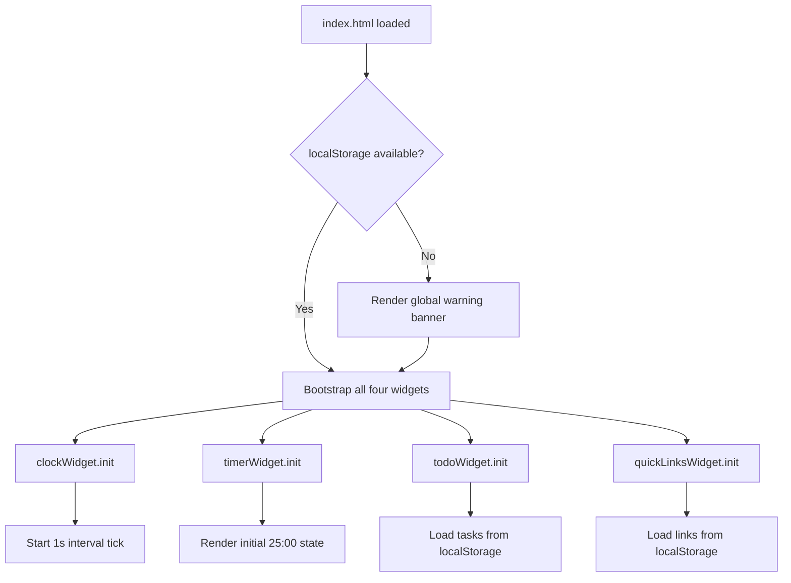
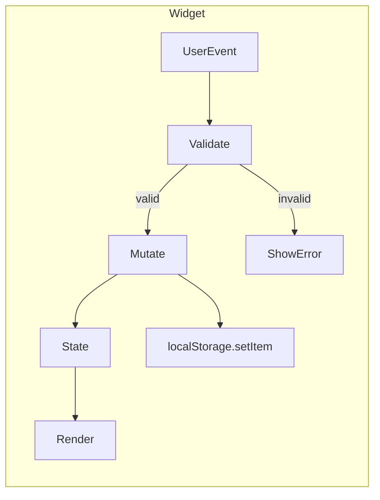
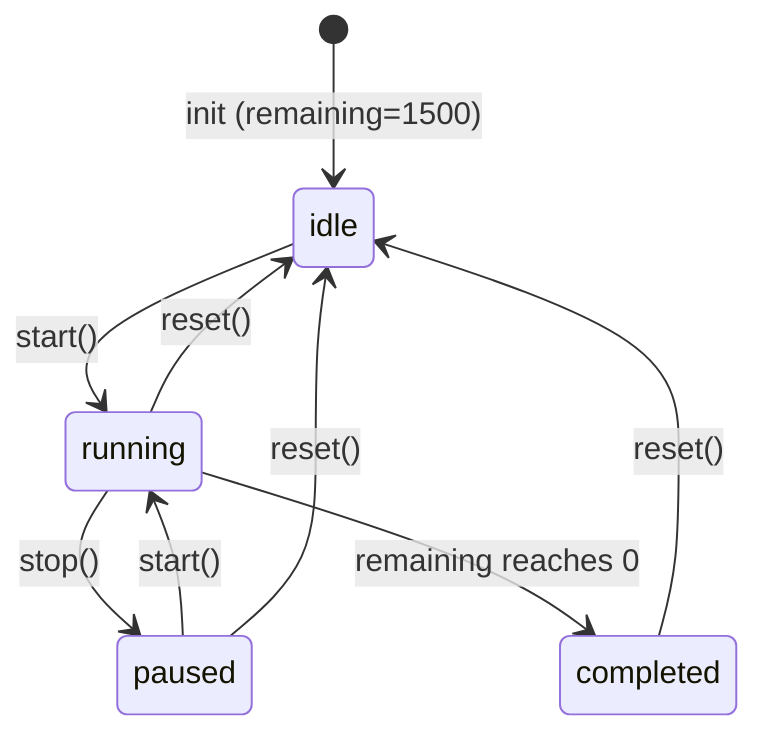

# Design Document: To-Do List Life Dashboard

## Overview

The To-Do Life Dashboard is a zero-dependency, single-page web application (SPA) built with HTML5, CSS3, and Vanilla JavaScript. It consolidates four productivity widgets — a Greeting & Clock, a Focus Timer (Pomodoro-style), a To-Do List, and a Quick Links manager — into a single responsive page. All state is persisted via the browser's `localStorage` API. No build tools, bundlers, or frameworks are required; the application ships as a static file bundle that any modern browser can open directly.

### Design Goals


- **Modular widget architecture** — each widget is a self-contained JS module with its own state, render logic, and localStorage key.
- **Correctness by default** — all user inputs are validated at the boundary; localStorage is guarded against parse failures.
- **Progressive degradation** — the app remains usable and informative even when localStorage is unavailable.

---

## Architecture

The application follows a **flat module architecture**: one HTML entry point loads a single JavaScript file (`app.js`) that bootstraps four independent widget modules. There is no virtual DOM, no state management library, and no routing layer.

```
index.html
├── css/
│   └── style.css          # All visual styles and responsive layout
└── js/
    ├── app.js             # Bootstrap: feature-detects localStorage, initialises widgets
    ├── clockWidget.js     # Clock_Widget: time, date, greeting
    ├── timerWidget.js     # Timer: Pomodoro countdown state machine
    ├── todoWidget.js      # ToDo_Widget: task CRUD + localStorage
    └── quickLinksWidget.js# QuickLinks_Widget: link CRUD + localStorage
```

### Boot Sequence



### Data Flow

Each widget owns its slice of state independently. There is no shared global state object. Widgets communicate with the DOM directly and write to `localStorage` synchronously on every mutation.



---

## Components and Interfaces

### 1. `app.js` — Bootstrap Module

Responsibilities:
- Detect `localStorage` availability via a `try/catch` write test.
- Render a non-dismissible warning banner if `localStorage` is unavailable.
- Call `init()` on each widget module in DOM-ready order.

```js
// Public interface
function isLocalStorageAvailable(): boolean
function showStorageWarning(): void
function init(): void   // called on DOMContentLoaded
```

### 2. `clockWidget.js` — Greeting & Clock

Responsibilities:
- Display the current local time (`HH:MM:SS`), updated every second via `setInterval`.
- Display the current date in long format.
- Display a time-of-day greeting based on the current hour.

```js
// Public interface
function init(): void
function formatTime(date: Date): string        // → "HH:MM:SS"
function formatDate(date: Date): string        // → "Weekday, D Month YYYY"
function getGreeting(hour: number): string     // → "Good Morning" | "Good Afternoon" | "Good Evening"
function tick(): void                          // called every 1000ms
```

Greeting logic (pure function, easy to unit/property test):

| Hour range   | Greeting       |
|--------------|----------------|
| 05–11        | Good Morning   |
| 12–17        | Good Afternoon |
| 18–23, 00–04 | Good Evening   |

### 3. `timerWidget.js` — Focus Timer

Responsibilities:
- Maintain a timer state machine with states: `idle`, `running`, `paused`, `completed`.
- Manage countdown via `setInterval` (1-second tick).
- Play an audio beep via the Web Audio API when the timer reaches zero.
- Apply a CSS animation class for ≥2 seconds on completion.
- Keep Start/Stop/Reset buttons in sync with state.

```js
// State shape
type TimerState = {
  remaining: number       // seconds remaining (0–1500)
  status: 'idle' | 'running' | 'paused' | 'completed'
}

// Public interface
function init(): void
function start(): void
function stop(): void
function reset(): void
function formatTime(seconds: number): string   // → "MM:SS"
function getButtonStates(status: TimerState['status']): ButtonStates
```

State machine transitions:



Button enabled/disabled rules:

| Status      | Start   | Stop    | Reset   |
|-------------|---------|---------|---------|
| `idle`      | enabled | disabled| enabled |
| `running`   | disabled| enabled | enabled |
| `paused`    | enabled | disabled| enabled |
| `completed` | disabled| disabled| enabled |

### 4. `todoWidget.js` — To-Do List

Responsibilities:
- Render a task list read from `localStorage` on init.
- Add, edit, toggle-complete, and delete tasks.
- Validate all inputs at the boundary (1–200 chars, non-empty after trim).
- Persist the full task array to `localStorage` synchronously after every mutation.

```js
// Task shape
type Task = {
  id: string            // UUID or timestamp-based unique key
  title: string         // 1–200 chars
  completed: boolean
}

// Public interface
function init(): void
function addTask(title: string): Result<Task, ValidationError>
function editTask(id: string, newTitle: string): Result<Task, ValidationError>
function toggleTask(id: string): Task
function deleteTask(id: string): void
function loadTasks(): Task[]    // reads + validates from localStorage
function saveTasks(tasks: Task[]): void
function validateTitle(title: string): ValidationResult
```

### 5. `quickLinksWidget.js` — Quick Links

Responsibilities:
- Render saved links from `localStorage` on init.
- Add and delete links.
- Validate name (non-empty, ≤100 chars) and URL (must begin with `http://` or `https://`).
- Enforce maximum 50 links; disable Add button at the limit.
- Persist full link array synchronously after every mutation.

```js
// Link shape
type Link = {
  id: string
  name: string   // 1–100 chars
  url: string    // must start with http:// or https://
}

// Public interface
function init(): void
function addLink(name: string, url: string): Result<Link, ValidationError[]>
function deleteLink(id: string): void
function loadLinks(): Link[]
function saveLinks(links: Link[]): void
function validateLink(name: string, url: string): ValidationResult
```

### 6. `storage.js` — Shared Storage Utilities

A thin shared module providing consistent serialization, deserialization, and schema validation for localStorage access.

```js
function readStorage<T>(key: string, validator: (item: unknown) => item is T): T[]
function writeStorage<T>(key: string, data: T[]): void

// Storage keys (constants)
const TASKS_KEY = 'tld_tasks'
const LINKS_KEY = 'tld_links'
```

---

## Data Models

### Task

```js
{
  id: string,         // e.g. "task_1719705600000_0" — timestamp + index
  title: string,      // 1–200 characters, trimmed
  completed: boolean  // false on creation
}
```

### Link

```js
{
  id: string,   // e.g. "link_1719705600000_0"
  name: string, // 1–100 characters, trimmed
  url: string   // must begin with "http://" or "https://"
}
```

### localStorage Schema

| Key         | Value type  | Content                  |
|-------------|-------------|--------------------------|
| `tld_tasks` | JSON string | `Task[]`                 |
| `tld_links` | JSON string | `Link[]`                 |

Keys are prefixed with `tld_` to avoid collisions with other apps sharing the same origin.

### Validation Rules Summary

| Field        | Rule                                              | Error message                           |
|--------------|---------------------------------------------------|-----------------------------------------|
| Task title   | `title.trim().length` in [1, 200]                 | "Task title cannot be empty."           |
| Link name    | `name.trim().length` in [1, 100]                  | "Name cannot be empty or over 100 characters." |
| Link URL     | starts with `http://` or `https://`               | "URL must start with http:// or https://" |
| Link count   | `links.length < 50` before add                    | (Add button disabled; no form message)  |

---

## Correctness Properties

---

### Property 1: Clock time format correctness

*For any* `Date` object, `formatTime(date)` SHALL return a string of exactly the form `HH:MM:SS` where HH, MM, and SS are zero-padded integers equal to the hours, minutes, and seconds of the given date.

**Validates: Requirements 2.1**

---

### Property 2: Clock date format correctness

*For any* `Date` object, `formatDate(date)` SHALL return a string that includes the correct full weekday name, numeric day, full month name, and four-digit year, in the prescribed format.

**Validates: Requirements 2.2**

---

### Property 3: Greeting correctness for all hours

*For any* integer `hour` in [0, 23], `getGreeting(hour)` SHALL return exactly:
- `"Good Morning"` when `hour` is in [5, 11]
- `"Good Afternoon"` when `hour` is in [12, 17]
- `"Good Evening"` when `hour` is in [18, 23] or [0, 4]

**Validates: Requirements 2.3, 2.4, 2.5, 2.6**

---

### Property 4: Timer display format correctness

*For any* integer `seconds` in [0, 1500], `formatTime(seconds)` SHALL return a string matching `MM:SS` where MM and SS are zero-padded and arithmetically correct (MM = floor(seconds/60), SS = seconds mod 60).

**Validates: Requirements 3.2**

---

### Property 5: Timer state machine correctness

*For any* timer status (`idle`, `running`, `paused`, `completed`) and any remaining-seconds value in [0, 1500], the functions `start()`, `stop()`, and `reset()` SHALL produce the correct next status and `getButtonStates(status)` SHALL return the correct enabled/disabled combination for Start, Stop, and Reset as defined in the state transition table.

**Validates: Requirements 3.3, 3.4, 3.5, 3.6, 3.10, 3.11, 3.12**

---

### Property 6: Valid task addition grows the task list

*For any* non-empty string `title` with `title.trim().length` in [1, 200], calling `addTask(title)` on any task list SHALL append exactly one new task with that trimmed title to the list in an incomplete state, increasing the list length by exactly 1.

**Validates: Requirements 4.2**

---

### Property 7: Invalid task input is rejected

*For any* string `input` where `input.trim().length === 0` (empty or whitespace-only), both `addTask(input)` and `editTask(id, input)` SHALL return a validation error, leave the task list unchanged, and display an inline validation message.

**Validates: Requirements 4.3, 4.8**

---

### Property 8: Task completion toggle is a round-trip

*For any* task in any completion state, toggling it twice via `toggleTask` SHALL return it to its original completion state — i.e., `toggleTask(toggleTask(task)).completed === task.completed`.

**Validates: Requirements 4.4, 4.5**

---

### Property 9: Valid task edit updates the title

*For any* task and any valid string `newTitle` with `newTitle.trim().length` in [1, 200], calling `editTask(id, newTitle)` SHALL update that task's title to `newTitle.trim()` and leave all other task fields and the rest of the task list unchanged.

**Validates: Requirements 4.6, 4.7**

---

### Property 10: Task deletion removes exactly one task

*For any* task list with at least one task and any task `id` in that list, calling `deleteTask(id)` SHALL reduce the list length by exactly 1 and the deleted task SHALL no longer appear in the list.

**Validates: Requirements 4.9**

---

### Property 11: Task persistence round-trip

*For any* sequence of add, edit, toggle, and delete operations on the task list, the JSON value written to `localStorage[TASKS_KEY]` SHALL be parseable and SHALL deserialize to an array equivalent to the in-memory task list at the time of the write.


---

### Property 12: Valid link addition is accepted

*For any* non-empty `name` with `name.trim().length` in [1, 100] and any `url` starting with `http://` or `https://`, calling `addLink(name, url)` on a list with fewer than 50 links SHALL append exactly one new link, increasing the list length by exactly 1.

**Validates: Requirements 5.4**

---

### Property 13: Invalid link submissions are rejected with field-specific errors

*For any* submission where `name.trim().length === 0`, `name.trim().length > 100`, or `url` does not begin with `http://` or `https://`, `addLink` SHALL return validation errors that identify each specific failing field, and the link list SHALL remain unchanged.

**Validates: Requirements 5.5, 5.11**

---

### Property 14: Link deletion removes exactly one link

*For any* link list with at least one link and any link `id` in that list, calling `deleteLink(id)` SHALL reduce the list length by exactly 1 and the deleted link SHALL no longer appear in the list.

**Validates: Requirements 5.6**

---

### Property 15: Link persistence round-trip

*For any* sequence of add and delete operations on the link list, the JSON value written to `localStorage[LINKS_KEY]` SHALL be parseable and SHALL deserialize to an array equivalent to the in-memory link list at the time of the write.


---

### Property 16: Link count limit enforces Add button state

*For any* link list of length `n`, the Add Link control SHALL be enabled if and only if `n < 50`.

**Validates: Requirements 5.10**

---

### Property 17: Storage validation discards malformed elements

*For any* JSON array stored in `localStorage` that contains a mix of valid Task (or Link) objects and objects missing required fields or having wrong types, `readStorage` SHALL return only the elements that pass the schema validator, silently discarding the rest.

**Validates: Requirements 6.3**

---

## Error Handling

### localStorage Unavailability

Detected at boot time in `app.js` using a `try/catch` write test:

```js
function isLocalStorageAvailable() {
  try {
    localStorage.setItem('__test__', '1');
    localStorage.removeItem('__test__');
    return true;
  } catch {
    return false;
  }
}
```

If unavailable: a fixed-position warning banner is injected at the top of `<body>` before widget initialization. Widgets degrade gracefully by skipping all persistence calls.

### JSON Parse Failures

All `localStorage.getItem` calls are wrapped:

```js
function readStorage(key, validator) {
  try {
    const raw = localStorage.getItem(key);
    if (!raw) return [];
    const parsed = JSON.parse(raw);
    if (!Array.isArray(parsed)) throw new Error('Not an array');
    return parsed.filter(validator);
  } catch (e) {
    console.warn(`[tld] Failed to read storage key "${key}":`, e);
    return [];
  }
}
```

- Non-array values → discard entirely, return `[]`.
- Array with invalid elements → silently filter out invalid elements.
- Any parse exception → log `console.warn` with the failing key, return `[]`.

### Input Validation Errors

All validation is synchronous and returns a structured result before any state mutation occurs. Error messages are rendered inline adjacent to the relevant input field. No mutation happens on validation failure.

### Timer Audio Failure

The Web Audio API `AudioContext` may be suspended in some browsers until a user gesture. The beep is generated only after a user interaction (Start button), which satisfies autoplay policy requirements. If `AudioContext` creation fails (e.g., in a very restricted environment), the failure is caught silently — the timer's visual/functional behavior is unaffected.

If `new Date()` throws or returns an invalid date, the clock widget catches the exception and renders a `"--:--:--"` / `"Date unavailable"` placeholder.

---

## Testing Strategy

### Overview

The testing strategy uses a **dual-layer approach**:

1. **Unit / example-based tests** — verify specific behaviors, error conditions, and integration points using concrete inputs.
2. **Property-based tests** — verify universal correctness properties across large randomly-generated input spaces.

Both layers are implemented using [Vitest](https://vitest.dev/) as the test runner and [fast-check](https://fast-check.io/) as the property-based testing library (both run entirely in Node.js, requiring no browser environment for logic tests).
### Test Structure

```
ests/
├── unit/
│   ├── clockWidget.test.js        # formatTime, formatDate, getGreeting
│   ├── timerWidget.test.js        # formatTime, state machine, button states
│   ├── todoWidget.test.js         # addTask, editTask, toggleTask, deleteTask
│   ├── quickLinksWidget.test.js   # addLink, deleteLink, validateLink
│   └── storage.test.js            # readStorage, writeStorage, error paths
└── property/
    ├── clock.property.test.js      # Properties 1, 2, 3
    ├── timer.property.test.js      # Properties 4, 5
    ├── todo.property.test.js       # Properties 6, 7, 8, 9, 10, 11
    ├── quickLinks.property.test.js # Properties 12, 13, 14, 15, 16
    └── storage.property.test.js    # Property 17
```

### Property-Based Testing Configuration

- **Library**: `fast-check` (pure JS, no browser required)
- **Minimum iterations per property**: 100 (fast-check default is 100; use `{ numRuns: 100 }`)
- **Tag format** for each property test:

```js
// Feature: todo-life-dashboard, Property 3: Greeting correctness for all hours
it.prop([fc.integer({ min: 0, max: 23 })])('getGreeting returns correct greeting', (hour) => {
  // ...
});
```

### Unit Test Focus Areas

| Area | Tests |
|---|---|
| localStorage unavailability | Warning banner appears; widgets initialize empty |
| `readStorage` with malformed JSON | Returns `[]`, logs `console.warn` with key name |
| `readStorage` with non-array JSON | Returns `[]` |
| Timer completes at 0 | Audio beep called exactly once; CSS class applied |
| Timer reset from any state | Returns to `idle` with `remaining = 1500` |
| All four widgets present on load | DOM has all four widget root elements |
| Links open in new tab | `target="_blank"` on anchor elements |
| Add Link form toggle | Form is shown/hidden correctly |
| Separate localStorage keys | `tld_tasks` ≠ `tld_links` |

### Integration / Smoke Tests

- Full page load in a headless browser (Playwright or manual) verifying all widgets render.
- Responsive layout at 768px viewport: single-column order verified.
- Load performance: verified manually via browser DevTools Network throttling.

### Accessibility

- All interactive controls have `aria-label` or visible text labels.
- Color contrast is validated against WCAG AA (4.5:1 for normal text) using the computed CSS values.
- Keyboard navigation is verified manually (Tab order, Enter/Space activation).
